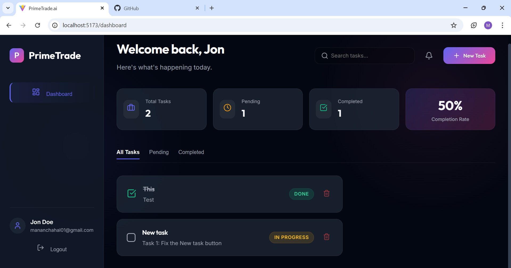
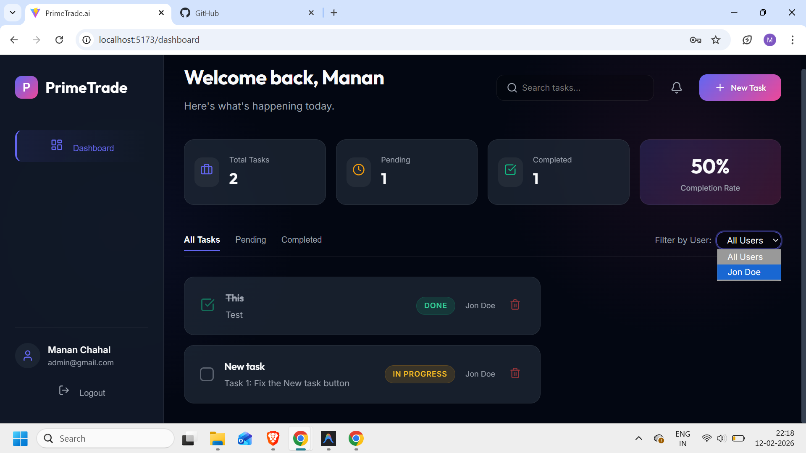
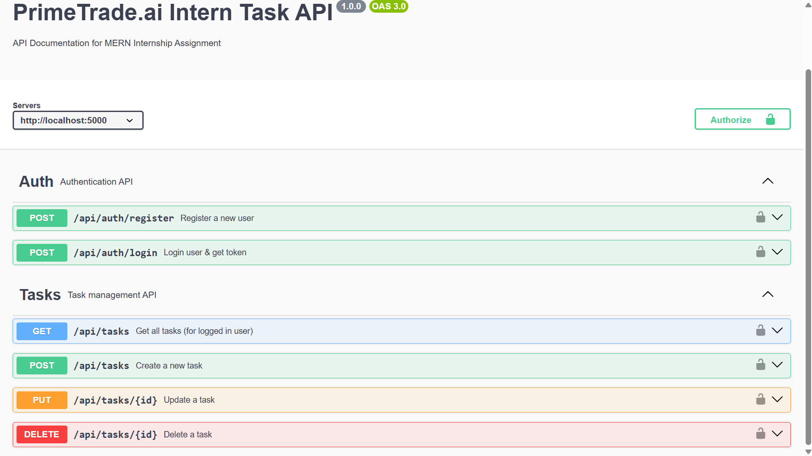

# Scalable REST API & Frontend Dashboard - PrimeTrade.ai Internship Task

> **Backend Developer Intern Assignment**  
> A secure, scalable MERN stack application featuring Role-Based Access Control (RBAC), JWT Authentication, and a premium frontend dashboard.



## 📌 Project Overview

This project was built to demonstrate **backend architectural best practices**, **security**, and **scalability**. It implements a complete User management system with Admin privileges, Task CRUD operations, and a modern, responsive React frontend.

The core focus is on writing **clean, modular, and testable code** that is ready for deployment.

### 🚀 Key Features

*   **🔐 Advanced Authentication**:
    *   Secure **JWT** (JSON Web Token) implementation for stateless authentication.
    *   **Bcrypt** password hashing for security.
    *   Protected Routes for both API and Frontend.

*   **🛡️ Role-Based Access Control (RBAC)**:
    *   **Admin**: distinct dashboard, ability to manage users, view all system tasks, and delete any resource.
    *   **User**: Individual dashboard, CRUD operations limited to own data.

*   **⚡ Scalable Backend Architecture**:
    *   **Modular Pattern**: distinct controllers, routes, and models.
    *   **RESTful API Standards**: Proper HTTP status codes (200, 201, 400, 401, 403, 404, 500) and conventions.
    *   **Middleware Chains**: For error handling, validation, and auth verification.

*   **🎨 Premium Frontend UI**:
    *   Built with **React + Vite** for high performance.
    *   Custom **Glassmorphism Design System** (no heavy UI libraries).
    *   Responsive Grid Layouts and interactive animations.

*   **📄 API Documentation**:
    *   Integrated **Swagger UI** for interactive API testing and documentation.

### Admin Portal
The secure admin login and dashboard for managing users and system-wide tasks.



## 🛠️ Tech Stack

*   **Backend**: Node.js, Express.js
*   **Database**: MongoDB (Mongoose ODM)
*   **Frontend**: React.js, Vite, Vanilla CSS 3 (CSS Variables, Flexbox/Grid)
*   **Security**: Helmet (HTTP Headers), CORS, Express-Validator, BCrypt, JWT
*   **Tools**: Postman, Swagger UI, Git

## ⚙️ Installation & Setup

### Prerequisites
*   Node.js (v14 or higher)
*   MongoDB (Local or Atlas Connection String)

### 1. Backend Setup
```bash
cd server
npm install

# Create a .env file
echo "PORT=5000" > .env
echo "MONGO_URI=your_mongodb_connection_string" >> .env
echo "JWT_SECRET=your_super_secret_key" >> .env

# Run in Development Mode
npm run dev
```

### 2. Frontend Setup
```bash
cd client
npm install

# Run the Vite Dev Server
npm run dev
```

The application will be available at:
*   **Frontend**: `http://localhost:5173`
*   **Backend API**: `http://localhost:5000`
*   **Swagger Docs**: `http://localhost:5000/api-docs`

## 📖 API Documentation

The API is fully documented using **Swagger/OpenAPI**.
Access the interactive documentation at: `http://localhost:5000/api-docs`



### Key Endpoints
| Method | Endpoint | Description | Access |
| :--- | :--- | :--- | :--- |
| `POST` | `/api/auth/register` | Register a new user | Public |
| `POST` | `/api/auth/login` | Login and receive JWT | Public |
| `GET` | `/api/tasks` | Get all tasks (User specific / Admin all) | Private |
| `POST` | `/api/tasks` | Create a new task | Private |

## 🏗️ Scalability & Design Decisions

> *See `scalability.md` for a deeper dive into the architectural choices.*

1.  **Stateless Authentication**: Using JWTs allows the backend to be horizontally scaled across multiple servers without needing sticky sessions.
2.  **Database Indexing**: Schemas are optimized with indexes on frequently queried fields like `email` and `user_id` to ensure O(1) or O(log n) lookup times.
3.  **Modular Monolith**: The codebase is structured to be easily decomposed into microservices (e.g., separating the `Auth` module) if traffic spikes.
4.  **Error Handling**: Centralized error responses ensure consistent debugging and client-side handling.

## 📂 Project Structure

```
PrimeTrade.ai/
├── client/                 # React Frontend
│   ├── src/
│   │   ├── context/        # Auth Context (Global State)
│   │   ├── pages/          # Dashboard, Login, Admin Panels
│   │   └── ...
├── server/                 # Node.js Backend
│   ├── controllers/        # Business Logic
│   ├── models/             # Database Schemas
│   ├── routes/             # API Endpoints
│   ├── middleware/         # Auth & Validation
│   └── ...
└── scalability.md          # Architecture Notes
```

---
**Developed by [Your Name] for PrimeTrade.ai**
